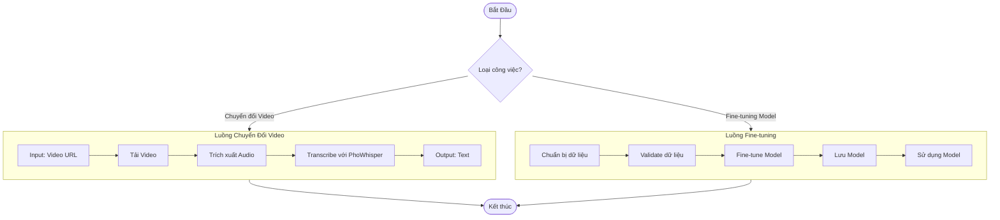
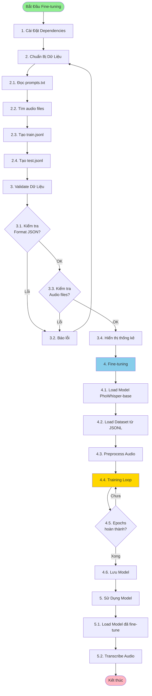
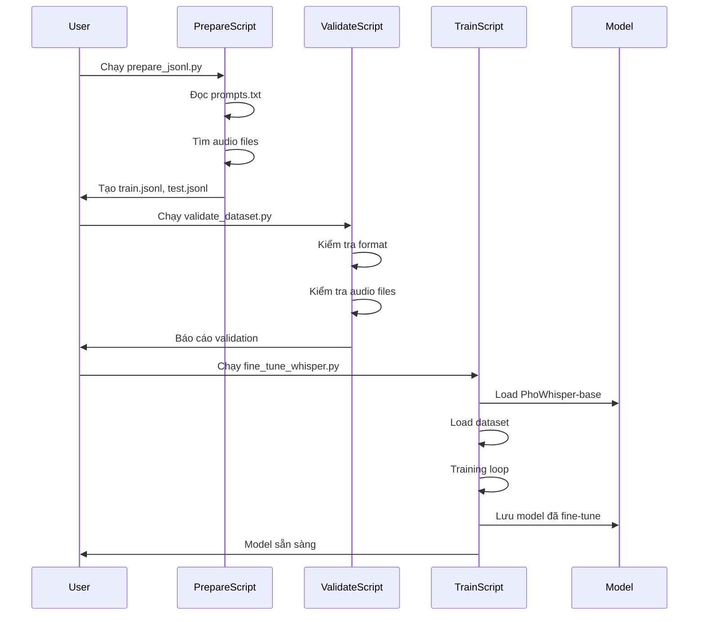
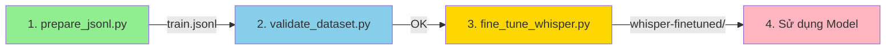

# 🎯 Video to Audio Text - Fine-tuning PhoWhisper

Dự án chuyển đổi video thành audio và text, với khả năng fine-tuning model Whisper/PhoWhisper cho tiếng Việt.

## 📋 Mục Lục

- [Tổng Quan Dự Án](#tổng-quan-dự-án)
- [Sơ Đồ Luồng Tổng Quan](#sơ-đồ-luồng-tổng-quan)
- [Sơ Đồ Luồng Fine-tuning](#sơ-đồ-luồng-fine-tuning)
- [Cài Đặt](#cài-đặt)
- [Hướng Dẫn Sử Dụng](#hướng-dẫn-sử-dụng)
- [Fine-tuning PhoWhisper-base](#fine-tuning-phowhisper-base)
- [Kết Quả Đầu Ra](#kết-quả-đầu-ra)
- [Tài Liệu Tham Khảo](#tài-liệu-tham-khảo)

---

## 🎯 Tổng Quan Dự Án

Dự án bao gồm 2 luồng chính:

1. **Luồng Chuyển Đổi Video → Audio → Text** (app.py)
   - Tải video từ URL
   - Trích xuất audio từ video
   - Chuyển đổi audio thành text bằng Whisper/PhoWhisper

2. **Luồng Fine-tuning Model** (fine_tune_whisper.py)
   - Chuẩn bị dữ liệu training
   - Fine-tune model Whisper/PhoWhisper
   - Sử dụng model đã fine-tune

---

## 📊 Sơ Đồ Luồng Tổng Quan



---

## 🔄 Sơ Đồ Luồng Fine-tuning Chi Tiết



---

## 🚀 Cài Đặt

### 1. Cài đặt dependencies

```bash
pip install -r requirements.txt
```

### 2. Cài đặt GPU support (nếu có NVIDIA GPU)

```bash
# Kiểm tra CUDA version
nvidia-smi

# Cài PyTorch với CUDA
pip install torch torchvision torchaudio --index-url https://download.pytorch.org/whl/cu118
```

---

## 📖 Hướng Dẫn Sử Dụng

### Luồng 1: Chuyển Đổi Video → Audio → Text

#### Bước 1: Khởi động Flask App

```bash
python app.py
```

**Kết quả:**
- Server chạy tại: `http://localhost:5000`
- File log: Console output

#### Bước 2: Sử dụng Web Interface

1. Mở trình duyệt: `http://localhost:5000`
2. Nhập URL video
3. Click "Chuyển đổi"
4. Nhận kết quả text

**Kết quả đầu ra:**
- Text transcription (hiển thị trên web)
- File audio tạm (tự động xóa sau khi xử lý)

---

### Luồng 2: Fine-tuning PhoWhisper-base

## 🎓 Fine-tuning PhoWhisper-base

### Tổng Quan Quy Trình



---

### Bước 1: Chuẩn Bị Dữ Liệu

#### 1.1. Tạo train.jsonl

**Lệnh:**
```bash
python prepare_jsonl.py \
    --audio-dir "archive/vivos/train/waves" \
    --prompts-file "archive/vivos/train/prompts.txt" \
    --output "data/train.jsonl" \
    --dataset-name "dataset"
```

**Kết quả đầu ra:**
- **File:** `data/train.jsonl`
- **Format:** JSONL với 11,660 entries
- **Nội dung mẫu:**
  ```json
  {"audio": "dataset/VIVOSSPK01/VIVOSSPK01_R001.wav", "sentence": "KHÁCH SẠN"}
  {"audio": "dataset/VIVOSSPK01/VIVOSSPK01_R002.wav", "sentence": "CHỈ BẰNG CÁCH LUÔN NỖ LỰC THÌ CUỐI CÙNG BẠN MỚI ĐƯỢC ĐỀN ĐÁP"}
  ```

**Thống kê:**
- ✅ Đã đọc: 11,660 prompts
- ✅ Tìm thấy: 11,660 audio files
- ✅ Khớp: 11,660 cặp audio-text

#### 1.2. Tạo test.jsonl

**Lệnh:**
```bash
python prepare_jsonl.py \
    --audio-dir "archive/vivos/test/waves" \
    --prompts-file "archive/vivos/test/prompts.txt" \
    --output "data/test.jsonl" \
    --dataset-name "dataset"
```

**Kết quả đầu ra:**
- **File:** `data/test.jsonl`
- **Format:** JSONL với 760 entries
- **Mục đích:** Dùng cho validation/evaluation

**Thống kê:**
- ✅ Đã đọc: 760 prompts
- ✅ Tìm thấy: 760 audio files
- ✅ Khớp: 760 cặp audio-text

---

### Bước 2: Validate Dữ Liệu

**Lệnh:**
```bash
python validate_dataset.py \
    --jsonl-file "data/train.jsonl" \
    --audio-dir "archive/vivos/train/waves"
```

**Kết quả đầu ra:**
- **Console output:** Báo cáo validation chi tiết
- **Thống kê:**
  ```
  ============================================================
  VALIDATION RESULTS
  ============================================================
  
  Tổng số entries: 11660
  Entries hợp lệ: 11660
  Entries không hợp lệ: 0
  
  Chi tiết lỗi:
    - Missing audio files: 0
    - Empty text: 0
    - Invalid JSON: 0
    - Audio errors: 0
  
  Thống kê text:
    - Độ dài trung bình: 45.2 ký tự
    - Độ dài min: 5 ký tự
    - Độ dài max: 120 ký tự
  
  Thống kê audio:
    - Độ dài trung bình: 8.5 giây
    - Độ dài min: 1.2 giây
    - Độ dài max: 30.5 giây
    - Tổng thời lượng: 165.2 giờ
  
  ✅ Dataset hợp lệ! Sẵn sàng cho fine-tuning.
  ```

---

### Bước 3: Fine-tuning Model

#### 3.1. Với GPU (Khuyến nghị)

**Lệnh:**
```bash
python fine_tune_whisper.py \
    --model-name "vinai/PhoWhisper-base" \
    --train-jsonl "data/train.jsonl" \
    --audio-dir "archive/vivos/train/waves" \
    --eval-jsonl "data/test.jsonl" \
    --output-dir "./whisper-finetuned" \
    --num-epochs 3 \
    --batch-size 16 \
    --learning-rate 1e-5 \
    --warmup-steps 500 \
    --fp16
```

**Kết quả đầu ra:**
- **Thư mục:** `./whisper-finetuned/`
- **Files:**
  - `config.json` - Cấu hình model
  - `pytorch_model.bin` hoặc `model.safetensors` - Weights của model
  - `tokenizer.json` - Tokenizer
  - `preprocessor_config.json` - Feature extractor config
  - `training_args.bin` - Training arguments
  - `trainer_state.json` - Training state
  - `checkpoint-*/` - Checkpoints (nếu có)

**Log mẫu:**
```
Đang load model: vinai/PhoWhisper-base
Sử dụng device: cuda
Đang load dataset từ: data/train.jsonl
Số entries hợp lệ: 11660
Đang chuẩn bị dataset...
Bắt đầu training...
Epoch 1/3: 100%|████████| 729/729 [15:23<00:00, 1.27s/it, loss=0.234]
Epoch 2/3: 100%|████████| 729/729 [15:18<00:00, 1.26s/it, loss=0.189]
Epoch 3/3: 100%|████████| 729/729 [15:21<00:00, 1.27s/it, loss=0.156]
Đang lưu model vào: ./whisper-finetuned
Hoàn thành fine-tuning!
```

**Thời gian ước tính:**
- GPU (RTX 3080): ~45-60 phút cho 3 epochs
- GPU (RTX 4090): ~30-40 phút cho 3 epochs

#### 3.2. Với CPU (Chậm hơn)

**Lệnh:**
```bash
python fine_tune_whisper.py \
    --model-name "vinai/PhoWhisper-base" \
    --train-jsonl "data/train.jsonl" \
    --audio-dir "archive/vivos/train/waves" \
    --output-dir "./whisper-finetuned" \
    --num-epochs 2 \
    --batch-size 4 \
    --learning-rate 1e-5
```

**Kết quả đầu ra:**
- Tương tự như GPU nhưng chậm hơn 10-20 lần
- **Thời gian ước tính:** ~10-15 giờ cho 2 epochs

---

### Bước 4: Sử Dụng Model Đã Fine-tune

#### 4.1. Trong Python Script

**Code:**
```python
from transformers import pipeline
import torch

# Load model đã fine-tune
pipe = pipeline(
    "automatic-speech-recognition",
    model="./whisper-finetuned",
    device=0 if torch.cuda.is_available() else -1,
)

# Transcribe audio
result = pipe("path/to/audio.wav")
print(result["text"])
```

**Kết quả đầu ra:**
- Text transcription từ audio file

#### 4.2. Trong app.py

**Sửa code:**
```python
# Thay đổi model path trong app.py
_phowhisper_pipe = pipeline(
    "automatic-speech-recognition",
    model="./whisper-finetuned",  # Model đã fine-tune
    device=0 if torch.cuda.is_available() else -1,
)
```

**Kết quả:**
- Web app sử dụng model đã fine-tune
- Độ chính xác cao hơn với dữ liệu tương tự

---

## 📁 Kết Quả Đầu Ra

### Tổng Hợp Files Đầu Ra

| Bước | Lệnh | File Đầu Ra | Mô Tả |
|------|------|-------------|-------|
| **1.1** | `prepare_jsonl.py --output train.jsonl` | `data/train.jsonl` | 11,660 entries training data |
| **1.2** | `prepare_jsonl.py --output test.jsonl` | `data/test.jsonl` | 760 entries test data |
| **2** | `validate_dataset.py` | Console output | Báo cáo validation |
| **3** | `fine_tune_whisper.py --output-dir ./whisper-finetuned` | `./whisper-finetuned/` | Model đã fine-tune |
| **4** | Sử dụng model | Text transcription | Kết quả transcribe |

### Cấu Trúc Thư Mục Sau Fine-tuning

```
./
├── data/
│   ├── train.jsonl          # Training data (11,660 entries)
│   └── test.jsonl            # Test data (760 entries)
│
├── whisper-finetuned/         # Model đã fine-tune
│   ├── config.json
│   ├── pytorch_model.bin
│   ├── tokenizer.json
│   ├── preprocessor_config.json
│   ├── training_args.bin
│   ├── trainer_state.json
│   └── checkpoint-*/          # Checkpoints (nếu có)
│
└── archive/
    └── vivos/
        ├── train/
        │   ├── prompts.txt
        │   └── waves/         # 11,660 audio files
        └── test/
            ├── prompts.txt
            └── waves/         # 760 audio files
```

---

## 📊 Tham Số Fine-tuning

### Tham Số Mặc Định (Khuyến nghị)

| Tham số | Giá trị | Mô tả |
|---------|---------|-------|
| `--model-name` | `vinai/PhoWhisper-base` | Model base |
| `--num-epochs` | `3` | Số epochs |
| `--batch-size` | `16` | Batch size (GPU) / `4` (CPU) |
| `--learning-rate` | `1e-5` | Learning rate |
| `--warmup-steps` | `500` | Warmup steps |
| `--fp16` | `True` | Mixed precision (GPU) |

### Điều Chỉnh Tham Số

**Nếu Out of Memory:**
```bash
--batch-size 8          # Giảm batch size
--gradient-accumulation-steps 2  # Tăng gradient accumulation
```

**Nếu Training quá chậm:**
```bash
--batch-size 32         # Tăng batch size (nếu đủ VRAM)
--fp16                  # Bật mixed precision
```

**Nếu Model không cải thiện:**
```bash
--num-epochs 5          # Tăng số epochs
--learning-rate 5e-6    # Giảm learning rate
```

---

## 🔍 Troubleshooting

### Lỗi: Out of Memory

**Giải pháp:**
```bash
# Giảm batch size
--batch-size 4

# Tăng gradient accumulation
--gradient-accumulation-steps 4

# Sử dụng model nhỏ hơn
--model-name "vinai/PhoWhisper-base"  # Thay vì large
```

### Lỗi: File audio không tìm thấy

**Giải pháp:**
- Kiểm tra đường dẫn trong JSONL
- Đảm bảo `--audio-dir` đúng
- Chạy `validate_dataset.py` để kiểm tra

### Lỗi: Training quá chậm

**Giải pháp:**
- Sử dụng GPU nếu có
- Bật `--fp16`
- Tăng `--batch-size` nếu đủ VRAM
- Giảm số epochs hoặc dataset size để test

---

## 📚 Tài Liệu Tham Khảo

- [FINE_TUNING_GUIDE.md](FINE_TUNING_GUIDE.md) - Hướng dẫn chi tiết
- [QUICK_START_FINETUNE.md](QUICK_START_FINETUNE.md) - Quick start
- [PhoWhisper trên Hugging Face](https://huggingface.co/vinai/PhoWhisper-base)
- [Transformers Documentation](https://huggingface.co/docs/transformers)

---

## 🎯 Tóm Tắt Workflow



**Thời gian ước tính:**
- Chuẩn bị dữ liệu: ~5 phút
- Validate: ~2 phút
- Fine-tuning (GPU): ~45-60 phút
- Fine-tuning (CPU): ~10-15 giờ

---

## ✅ Checklist Fine-tuning

- [ ] Cài đặt dependencies (`pip install -r requirements.txt`)
- [ ] Tạo `data/train.jsonl` (11,660 entries)
- [ ] Tạo `data/test.jsonl` (760 entries)
- [ ] Validate dữ liệu (không có lỗi)
- [ ] Fine-tuning với GPU/CPU
- [ ] Kiểm tra model đã lưu tại `./whisper-finetuned/`
- [ ] Test model với audio mẫu

---

**Chúc bạn fine-tuning thành công! 🎉**

